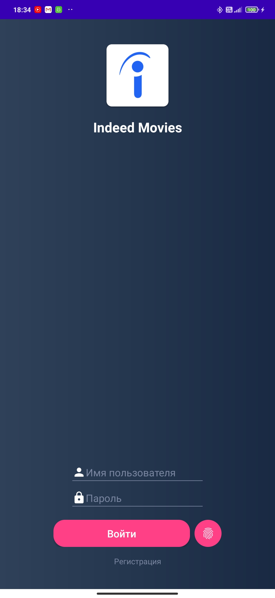
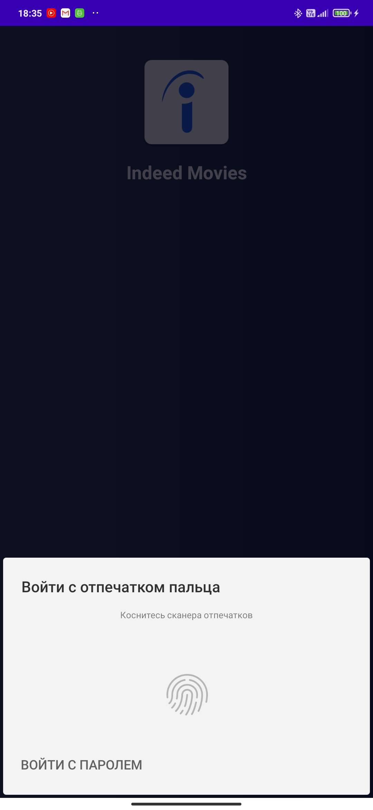
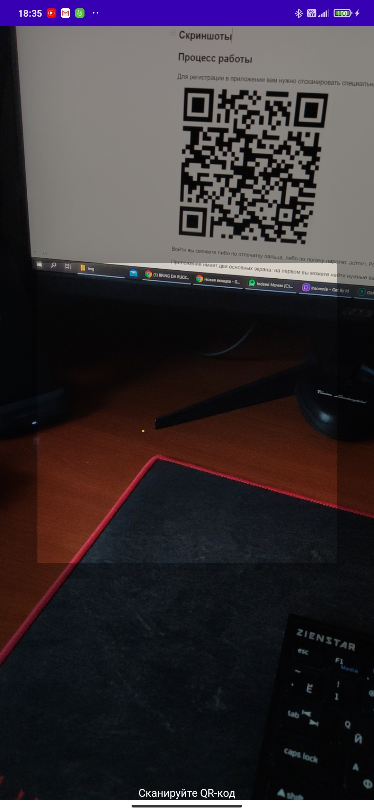
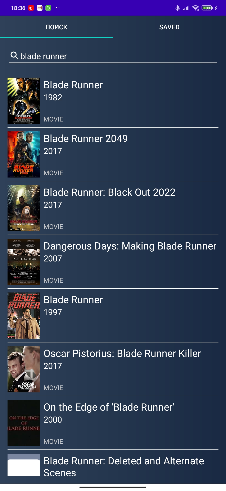
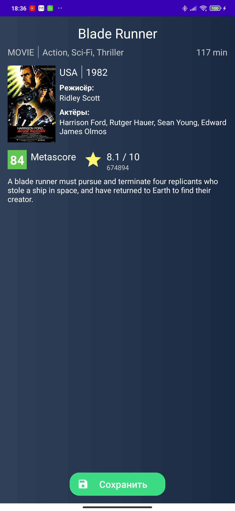
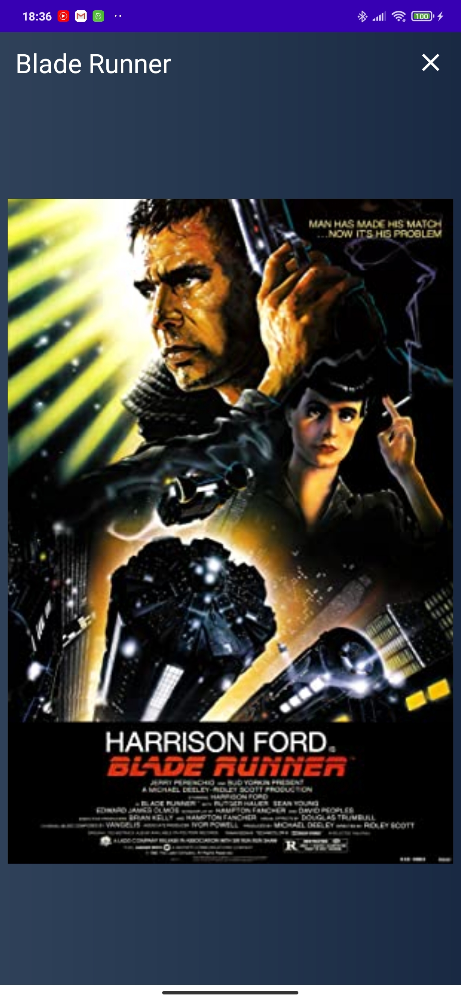

# Indeed Movies

Indeed Movies is an example app to demonstrate code example. With it you can find movies on IMDB and save what you like.

### Synopsis

The project had been developed as a coding task in company, but later it was slightly redesigned to be a code sample. Project meets all initial requirements.   [The task (contacts were removed)](img/TaskText.png)

### Technology stack

**Language** - Kotlin 1.3;
**Technologies** - HTTP, SQLite, Filesystem, QR-Scanning, Fingerprint Scanning, KeyStore, Base64;
**Libraries** - Navigation Component, Dagger2, Retrofit2, Room, RxJava2, Zxing, SecurePreferences;
**API** - OMDB API

### Screenshots

|  |  |  |
| ------------------------------------------------------------ | ------------------------------------------------------------ | ------------------------------------------------------------ |
|  |  |  |

### Workflow

You will need a special QR-code to register. This, for instance:
  

You can log in either using your fingerprint or with password: admin, P@assw0rd (zero in the end). It will log out when you exit.

The app has two main screens: on first you can search for some movies, and second displays saved movies.

Click poster to enlarge it. Click movie to view it's details or save to your device.

### API notes

* The app isn't translated to russian as OMDB API works only in English to avoid visual mess
* This is also the reason why you have to search using Englis queries