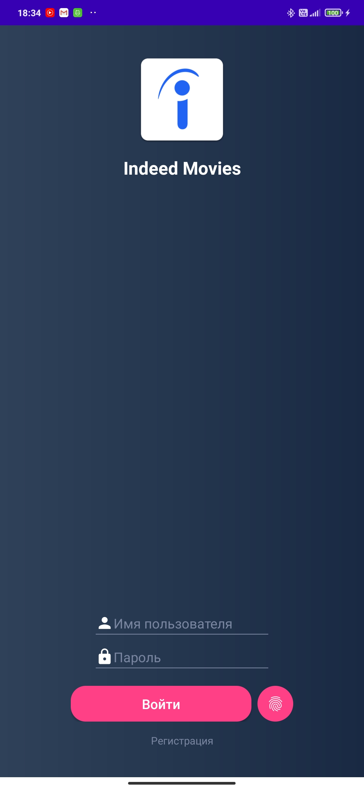
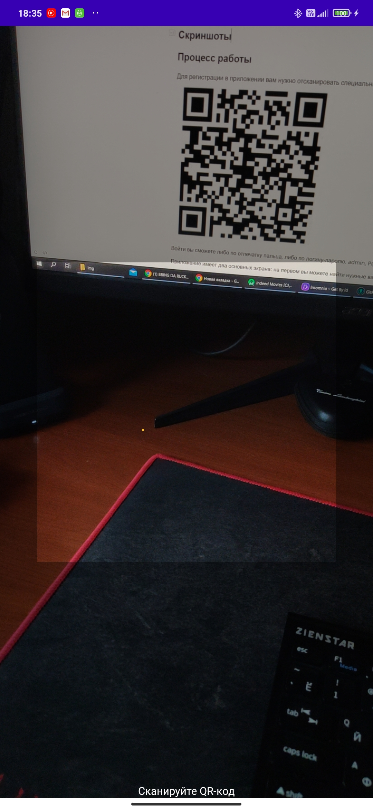

# Indeed Movies

Indeed Movies - приложение-пример для демонстрации кода. С помощью него вы можете находить фильмы на IMDB и сохранять понравившиеся.

### Синопсис
Проект был разработан в качестве тестового задания в компанию, и позже был слегка доработан для публикации в качестве примера кода. Проект изначальным требованиям удовлетворяет.  [Задание (контактные данные удалены)](img/TaskText.png)

### Стек технологий
**Язык** - Kotlin;
**Технологии** - HTTP, SQLite, файловая система, QR-сканнирование, сканирование отпечатка пальца, KeyStore, Base64;
**Библиотеки** - Navigation Component, Dagger2, Retrofit2, Room, RxJava2, Zxing, SecurePreferences;
**API** - OMDB API

### Скриншоты

|      |      |      |
| ---- | ---- | ---- |
|      |      |      |

### Процесс работы
Для регистрации в приложении вам нужно отсканировать специальный QR-код. Например, такой:   

Войти вы сможете либо по отпечатку пальца, либо по логину-паролю: admin, P@ssw0rd (в конце нуль). Логин сбрасывается при выходе из приложения.

Приложение имеет два основных экрана: на первом вы можете найти нужные вам фильмы, а на втором - посмотреть сохранённые.

Для просмотра постера нажмите на него. Для просмотра детальной информации и сохранения офлайн нажмите на фильм.

### Примечания по API
* Приложение не переведено на русский во избежание путаницы, т.к. OMDB API работает только на английском;

* По этой же причине искать фильм нужно только на английском языке;

  